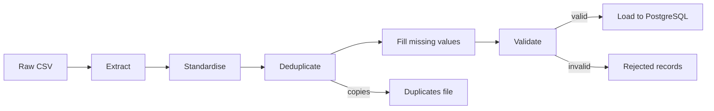
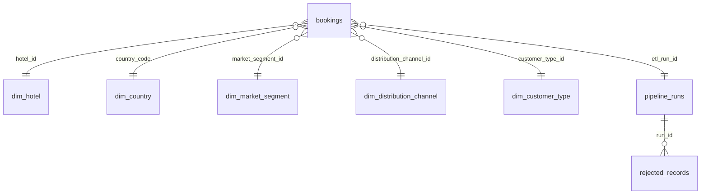

# Hotel Bookings ETL Pipeline

**Associate Data Engineer Technical Examination – Luxury Explorers**

Submitted by Gimsara Elgiriyage

A small data application that ingests a messy, real-world hotel bookings export, cleans and
validates it with Python, and loads it into PostgreSQL for analysis, with AWS S3 integration.

## Project structure

```
.
├── data/
│   ├── source/            # original public dataset, unmodified
│   ├── raw/               # generated raw/dirty dataset used as the ETL input
│   ├── sample/            # 200-row preview of the raw dataset
│   ├── processed/         # clean output per run (git-ignored)
│   └── rejected/          # rejected + duplicate rows per run (git-ignored)
├── infra/
│   └── iam/etl-s3-policy.json # least-privilege IAM policy for the pipeline user
├── etl/
│   ├── config.py          # settings from environment variables / .env
│   ├── storage.py         # AWS S3 uploads (raw landing, processed, rejected)
│   ├── extract.py         # read raw CSV as text, column check, file checksum
│   ├── mappings.py        # canonical values, formats and cleaning policy
│   ├── transform.py       # standardise, deduplicate, fill missing values
│   ├── validate.py        # business rules -> rejection reasons
│   ├── load.py            # PostgreSQL: dimensions, COPY + upsert, audit tables
│   └── logging_setup.py
├── docs/
│   └── query_performance.md   # generated before/after benchmark report
├── scripts/
│   ├── make_raw_dataset.py
│   └── benchmark_queries.py   # index before/after benchmark
├── sql/
│   ├── schema.sql             # star schema + etl audit tables
│   ├── indexes.sql            # secondary indexes
│   └── analytical_queries.sql # analytical queries
├── tests/
│   └── test_transform.py
├── logs/                  # one log file per run (git-ignored)
├── docker-compose.yml     # PostgreSQL 16
├── run_pipeline.py        # pipeline entry point
├── .env.example
├── requirements.txt
└── README.md
```

## Setup

Requirements: Python 3.10+ and Docker.

```bash
python -m venv .venv
.venv\Scripts\activate          # Windows  (source .venv/bin/activate on macOS/Linux)
pip install -r requirements.txt

cp .env.example .env            # then set PGPASSWORD to any strong value
docker compose up -d            # PostgreSQL 16 on localhost:5433

python run_pipeline.py          # run the ETL
pytest                          # run the unit tests
```

The database password and other settings are only ever read from environment variables
(`.env` is git-ignored). `docker compose` uses the same `.env`, so the container and the
pipeline always agree on credentials.

## 1. Base dataset

### Source

[Hotel booking demand datasets](https://doi.org/10.1016/j.dib.2018.11.126) (Antonio, Almeida &
Nunes, 2019, *Data in Brief*): 119,390 real bookings for a city hotel (Lisbon) and a resort
hotel (Algarve) with arrivals between July 2015 and August 2017. The data is published under
[CC BY 4.0](https://creativecommons.org/licenses/by/4.0/) and was taken from the
[TidyTuesday mirror](https://github.com/rfordatascience/tidytuesday/tree/main/data/2020/2020-02-11).

Both the unmodified source (`data/source/hotels.csv`, 16.9 MB) and the generated raw file
(`data/raw/hotel_bookings_raw.csv`, 14.8 MB) are committed, so the pipeline runs on a fresh
clone without any download step.

The travel/hospitality domain was chosen because it matches the business, and the full
119k rows are kept (rather than the 10k minimum) so that the indexing benefits in PostgreSQL are
measurable rather than theoretical.

### Generating the raw dataset

```bash
python scripts/make_raw_dataset.py            # writes data/raw/hotel_bookings_raw.csv
```

The script reads `data/source/hotels.csv` (downloading it if missing), reshapes it into a single
raw export and injects seeded noise. Output is deterministic for a given `--seed` (default `42`),
so regenerating reproduces the committed file exactly.

Result: **119,390 rows x 20 columns**, 87,396 unique bookings.

| Column | Type (after cleaning) | Notes |
|---|---|---|
| `booking_id` | string | Added; identical source rows share an id |
| `hotel` | string | `City Hotel` / `Resort Hotel` |
| `is_canceled` | boolean | |
| `lead_time` | integer | Days between booking and arrival |
| `arrival_date` | date | Built from the source's separate year/month/day columns |
| `stays_in_weekend_nights`, `stays_in_week_nights` | integer | |
| `adults`, `children`, `babies` | integer | |
| `meal` | string | `BB`, `HB`, `FB`, `SC`, `Undefined` (SC and Undefined both mean no meal) |
| `country` | string | ISO 3166-1 alpha-3 |
| `market_segment`, `distribution_channel` | string | Booking category / channel |
| `deposit_type`, `customer_type` | string | |
| `adr` | numeric | Average daily rate in EUR (price) |
| `total_of_special_requests` | integer | |
| `reservation_status` | string | `Check-Out`, `Canceled`, `No-Show` |
| `reservation_status_date` | date | Date the status was last set |

### Data-quality problems in the raw file

Real problems that come with the source data:

| Problem | Rows |
|---|---|
| Duplicate bookings (same `booking_id`) | 31,994 |
| `NULL` text instead of a country | 488 |
| `NA` text instead of a children count | 4 |
| `Undefined` meal / market segment / distribution channel | 1,169 / 2 / 5 |
| China coded as `CN` instead of `CHN` | 1,279 |
| Negative ADR / ADR above 5,000 | 1 / 1 |
| Bookings with zero guests | 180 |

Noise injected by the generator to simulate a messy export (counts for seed `42`):

| Problem | Rows |
|---|---|
| `arrival_date` in 5 formats (`2015-07-01`, `01/07/2015`, `01-Jul-2015`, `2015/07/01`, `July 01, 2015`) | 35,883 non-ISO |
| `reservation_status_date` in 4 formats, some with a time component | 29,881 non-ISO |
| Impossible / unparseable arrival dates (`2016-02-30`, `TBD`, ...) | 41 |
| Inconsistent casing and whitespace in text columns (`CITY HOTEL`, `  Resort Hotel`, `online ta`) | ~46,700 |
| `is_canceled` as `yes/no`, `true/false`, `Y/N` instead of `0/1` | 9,636 |
| Country as lower-case code, padded, or full name (`prt`, ` GBR `, `Portugal`) | 8,243 |
| `adr` with currency symbols or comma decimals (`€98.00`, `98.00 EUR`, `98,00`) | 17,880 |
| Integers written as floats (`2.0`) in `adults` / `children` | 5,862 |
| Negative `lead_time` | 110 |
| Missing values as blanks or `N/A`, `null`, `-` across 7 columns | 5,022 |

Because the noise is applied per row, only 7,051 of the 31,994 duplicate copies are still
byte-identical. The rest differ only in formatting, so duplicates must be detected by key after
standardisation, not by comparing raw rows.

A 200-row preview is committed at [`data/sample/hotel_bookings_raw_sample.csv`](data/sample/hotel_bookings_raw_sample.csv).

## 2. ETL pipeline

```bash
python run_pipeline.py                  # extract -> transform -> validate -> load
python run_pipeline.py --no-load        # same, but skip PostgreSQL (writes the output files only)
python run_pipeline.py --input other.csv --log-level DEBUG
```

The command exits with code `0` on success and `1` on failure, so it can be scheduled
directly by cron or an orchestrator.



### Extract ([`etl/extract.py`](etl/extract.py))

Every column is read as text, so nothing is coerced before the cleaning rules see it. The file
must contain all 20 expected columns, and its SHA-256 is recorded with the run so every load
can be traced back to the exact input file.

### Standardise ([`etl/transform.py`](etl/transform.py))

| Field(s) | Rule |
|---|---|
| All text | Trim, collapse repeated spaces. `""`, `NA`, `N/A`, `NULL`, `null`, `none`, `-` become missing |
| Categories (`hotel`, `meal`, `market_segment`, ...) | Matched case-insensitively to the canonical value (`CITY  HOTEL` becomes `City Hotel`). `meal = Undefined` becomes `SC` (the dataset defines both as "no meal") |
| `is_canceled` | `1/0`, `yes/no`, `true/false`, `Y/N` become a boolean |
| Integer columns | `2.0` becomes `2`; fractions such as `2.5` are invalid |
| `adr` (price) | `€`, `EUR` and spaces removed, decimal comma converted (`98,00` becomes `98.00`) |
| Dates | Each known format is tried in turn (`2015-07-01`, `01/07/2015`, `01-Jul-2015`, `2015/07/01`, `July 01, 2015`, plus timestamps and `01.07.2015` for the status date). Slash dates are day-first because the source system is European |
| `country` | Resolved to ISO 3166-1 alpha-3 with `pycountry` (`prt`, `Portugal` and `PRT` all become `PRT`), plus `CN` to `CHN` and the retired `TMP` to `TLS` |

Each standardiser also returns an **invalid** flag: the value was present but could not be parsed
(e.g. `2016-02-30` or `TBD`). Missing and invalid values are handled differently: missing values
may be filled with a default, invalid values are always rejected.

### Deduplicate

Duplicates are detected by `booking_id` **after** standardisation, because most copies only differ
in formatting. For each booking the copy with the most populated fields is kept, so a copy whose
price was blanked is replaced by a sibling that still has it. Removed copies are written to
`data/rejected/duplicates_<run>.csv`.

### Fill missing values

| Field | Default | Why |
|---|---|---|
| `children` | `0` | Only 4 source rows; no children is the overwhelmingly common case |
| `meal` | `SC` | Same meaning as the source's own `Undefined` |
| `market_segment`, `customer_type` | `Undefined` | Keeps the booking for revenue analysis under an explicit "unknown" member |
| `country` | `UNK` | An `Unknown` member of `dim_country`, so the foreign key never needs to be NULL |

Missing `hotel`, `arrival_date`, `adr`, `adults` or `reservation_status_date` are **not** filled:
inventing a price, date or guest count would distort revenue and occupancy figures, so those rows
are rejected.

### Validate ([`etl/validate.py`](etl/validate.py))

Every rule mirrors a constraint in [`sql/schema.sql`](sql/schema.sql), so a row that passes Python
validation cannot fail in the database. A row collects all reasons it fails, not just the first.

| Reason code | Rule | Rows (seed 42) |
|---|---|---|
| `missing_<column>` | Required field is empty | 1,205 |
| `invalid_<column>` | Value present but unparseable or not an allowed category | 27 |
| `no_guests` | `adults + children + babies = 0` | 166 |
| `negative_lead_time` | `lead_time < 0` | 78 |
| `adr_out_of_range` | `adr < 0` or `adr > 1000` (the source has one booking at 5,400 and one at -6.38) | 2 |
| `negative_nights`, `negative_guest_count` | Counts below zero | 0 |
| `invalid_booking_id_format` | Not `BKG-` + 6 digits | 0 |
| `cancellation_status_mismatch` | `is_canceled` must be true exactly for `Canceled` / `No-Show` | 0 |
| `checkout_before_arrival` | A `Check-Out` status dated before arrival | 0 |
| `cancellation_after_arrival` | A `Canceled` status dated after arrival | 0 |

The zero-count rules were checked against the real source data, which satisfies them; they guard
against bad future exports. Zero-night stays are allowed: all 715 in the source are priced at
0, consistent with day-use or complimentary bookings.

Rejected rows are written with their **original raw values**, the CSV line number and a
`rejection_reasons` column to `data/rejected/rejected_<run>.csv`, and to `etl.rejected_records`
in PostgreSQL (raw record as `JSONB`, reasons as `TEXT[]`).

### Load ([`etl/load.py`](etl/load.py))

1. Apply [`sql/schema.sql`](sql/schema.sql) and [`sql/indexes.sql`](sql/indexes.sql) (idempotent `CREATE ... IF NOT EXISTS`).
2. Register the run in `etl.pipeline_runs` with status `running`.
3. Upsert the dimension members and map their surrogate keys onto the clean rows.
4. Stream the clean rows into a temporary staging table with `COPY`, the fastest bulk-load path
   in PostgreSQL, instead of row-by-row `INSERT`s.
5. Merge into `bookings` with `INSERT ... ON CONFLICT (booking_id) DO UPDATE`, so re-running the
   pipeline updates rows in place and never duplicates them.
6. Insert the rejected records.
7. `VACUUM (ANALYZE) bookings`, then mark the run `success` (or `failed` with the error message).

Steps 3-6 run in **one transaction**: a failure rolls back the whole load, leaving the previous
data untouched. Step 7 matters because the upsert rewrites every row: vacuuming removes the
replaced row versions and marks pages all-visible, which index-only scans rely on (see section 3).

### Schema ([`sql/schema.sql`](sql/schema.sql))



- **`bookings`** (fact): one row per booking, `booking_id` primary key. Low-cardinality fixed code
  sets (`meal`, `deposit_type`, `reservation_status`) are `CHECK`-constrained columns rather than
  extra joins. `total_nights` and `revenue` (`adr x nights`, 0 when canceled) are stored generated
  columns, so every query uses the same revenue definition.
- **Dimensions**: `dim_hotel` (with type and location), `dim_country` (ISO code + name),
  `dim_market_segment`, `dim_distribution_channel`, `dim_customer_type`.
- **`etl` schema**: `pipeline_runs` (one row per run with status, input checksum and row counts)
  and `rejected_records`.

### Results (seed 42)

| Stage | Rows |
|---|---|
| Extracted | 119,390 |
| Duplicates removed | 31,994 |
| Unique bookings | 87,396 |
| Missing values filled | 2,612 |
| Rejected | 1,470 |
| **Loaded into `bookings`** | **85,926** |

The full run takes about 20 seconds locally. Useful checks after a run:

```sql
SELECT status, rows_extracted, rows_duplicates, rows_rejected, rows_loaded
FROM etl.pipeline_runs ORDER BY started_at DESC LIMIT 5;

SELECT reason, count(*)
FROM etl.rejected_records, unnest(reasons) AS reason
GROUP BY reason ORDER BY 2 DESC;
```

```bash
docker exec -it hotel_bookings_pg psql -U etl_user -d hotel_bookings
```

## 3. Database design and optimisation

### Schema decisions

| Decision | Reason |
|---|---|
| Star schema: `bookings` fact + 5 dimensions | Analytical queries group by hotel, country, segment, channel and customer type; dimensions keep those names in one place and the fact table narrow |
| `SMALLINT` identity keys for dimensions, ISO-3 `CHAR(3)` natural key for country | Small, stable join keys; the country code is already a standard, meaningful identifier |
| `booking_id` primary key on the fact table | The business key from the source system; makes the load idempotent via `ON CONFLICT` |
| `NUMERIC(10,2)` for money, `SMALLINT` for counts | Exact decimal arithmetic for revenue (no float rounding); compact rows |
| `CHECK` constraints mirroring the pipeline's validation rules, `NOT NULL` everywhere | The database enforces data quality on its own, even if something bypasses the pipeline |
| `CHECK` lists for `meal`, `deposit_type`, `reservation_status` | 3-4 fixed values each; a dimension would only add a join |
| Generated `total_nights` and `revenue` columns | One revenue definition for every query and report |
| Separate `etl` schema with run lineage (`bookings.etl_run_id`) | Every row can be traced to the run and input file that loaded it |

### Analytical queries ([`sql/analytical_queries.sql`](sql/analytical_queries.sql))

| Query | Question | Brief's example |
|---|---|---|
| `q1_top_segments_by_revenue` | Top 10 market segments by revenue, 2016 Q3 arrivals | Top 10 categories by revenue |
| `q2_monthly_revenue_growth` | City Hotel monthly revenue with month-over-month growth (`LAG()`) | Monthly growth analysis |
| `q3_country_drilldown` | Germany: monthly bookings, average daily rate, cancellation rate | Drill-down by country |
| `q4_adr_by_country` | Average daily rate and cancellation rate for the top 10 countries | Average rating by country (the dataset has no rating, so average daily rate stands in) |

### Indexes ([`sql/indexes.sql`](sql/indexes.sql))

| Index | Serves | Shape and why |
|---|---|---|
| `idx_bookings_arrival_segment_revenue` | q1 | `(arrival_date) INCLUDE (market_segment_id, revenue) WHERE NOT is_canceled`. The date range is the filter, so it leads. **Partial**: only non-canceled bookings carry revenue (72% of rows). **Covering**: every column q1 reads is in the index, so the table is never touched |
| `idx_bookings_hotel_arrival_revenue` | q2 | `(hotel_id, arrival_date) INCLUDE (revenue) WHERE NOT is_canceled`. Equality column first, range/grouping column second, the standard composite-index order |
| `idx_bookings_country_arrival` | q3 | `(country_code, arrival_date) INCLUDE (adr, is_canceled)`. Not partial, because the cancellation rate needs canceled bookings too |
| `idx_rejected_records_run_id` | audit queries | PostgreSQL does not index foreign keys automatically; rejected records are always looked up by run |

### Results

Run `python scripts/benchmark_queries.py`. It drops the indexes, measures every query, creates
the indexes and measures again (median of 7 `EXPLAIN ANALYZE` runs, warm cache, PostgreSQL 16,
85,926 bookings). Full plans are in [`docs/query_performance.md`](docs/query_performance.md).

| Query | Before | After | Speed-up | Pages read | Plan before -> after |
|---|---:|---:|---:|---:|---|
| q1 top segments | 7.53 ms | 1.84 ms | **4.1x** | 3,085 -> 37 | Seq Scan -> Index Only Scan |
| q2 monthly growth | 14.99 ms | 9.21 ms | 1.6x | 3,086 -> 146 | Seq Scan -> Index Only Scan |
| q3 country drill-down | 5.77 ms | 1.48 ms | **3.9x** | 3,084 -> 25 | Seq Scan -> Index Only Scan |
| q4 ADR by country | 15.53 ms | 12.81 ms | 1.2x | 3,136 -> 387 | Seq Scan -> Index Only Scan |

The page counts matter more than the milliseconds. On a warm cache the whole 24 MB table is
already in memory, so scanning it is cheap. On a cold cache, or with a table larger than memory,
every one of those ~3,085 pages is a disk read, and the gap grows with the table.

### Optimisation decisions

- **Selective queries benefit most.** q1 and q3 touch about 10% and 6% of the rows; their indexes
  cut the pages read by about 100x.
- **Covering + partial beats a plain index.** A plain `(arrival_date)` index would still have to
  visit the table for `revenue` and `market_segment_id` on every matching row. `INCLUDE` turns
  that into an index-only scan, and `WHERE NOT is_canceled` keeps each index under 2 MB, against
  24 MB for the table.
- **Non-selective queries barely benefit.** q2 reads 43% of the table and q4 reads all of it, so
  their time goes on aggregation, not on reading. q4 got no index of its own; the planner reuses
  the country index as a narrower copy of the table, which helps a little. The real fix for
  dashboard-style full aggregations is pre-aggregation (a materialized view or summary table
  refreshed by the pipeline), not more indexes.
- **Index-only scans need a vacuumed table.** They skip the table only for pages marked
  all-visible, so the pipeline runs `VACUUM (ANALYZE)` after every load. Afterwards the plans
  show `Heap Fetches: 0`.
- **Indexes not created:**
  - Single-column indexes on low-cardinality foreign keys (`hotel_id` has 2 values,
    `market_segment_id` 8). The planner would not use them, and each one slows every upsert.
  - A BRIN index on `arrival_date`. Rows arrive in random order, so the per-block date ranges
    would all overlap. With time-ordered loads at larger volumes BRIN becomes attractive (see
    section 5).
- **Every index has a write cost.** The three `bookings` indexes add 6.4 MB and are maintained on
  every upsert. At this size the load is still about 7 seconds; at millions of rows, bulk loads
  would drop and rebuild the indexes, or load into partitions.

## 4. AWS S3 integration

The pipeline uses S3 in all three ways the brief lists:

| When | What | S3 key |
|---|---|---|
| Right after extract, **before processing** | The raw input file exactly as received | `raw/dt=YYYY-MM-DD/hotel_bookings_raw.csv` |
| After transform and validation | Clean output | `processed/dt=YYYY-MM-DD/bookings_clean_<run>.csv` |
| After transform and validation | Backup of rejected and duplicate records | `rejected/dt=YYYY-MM-DD/rejected_<run>.csv`, `duplicates_<run>.csv` |

Every object carries the `run-id` (and, for the raw file, its `sha256`) as S3 metadata. The raw
and processed S3 URIs are stored on the run's row in `etl.pipeline_runs`, so each load can be
traced back to the exact file in S3. The `dt=` prefixes are Hive-style partitions, so the bucket
can later be queried directly with Athena or Spark.

S3 is enabled when `S3_BUCKET` is set and skipped otherwise, or with `--no-s3`. A failed upload
fails the run with a clear error.

### Bucket setup

- Region `ap-south-1`, **Block all public access** on, **versioning** on (re-uploading a file on
  the same day keeps the previous version, which makes `rejected/` and `processed/` real backups).
- Objects are written with server-side encryption (SSE-S3, `AES256`).

### Security

- **Least privilege IAM.** The pipeline runs as a dedicated IAM user `hotel-bookings-etl` with no
  console access. Its only policy, [`infra/iam/etl-s3-policy.json`](infra/iam/etl-s3-policy.json),
  allows `s3:PutObject` and `s3:GetObject` on `raw/*`, `processed/*` and `rejected/*`, and
  `s3:ListBucket` limited to those prefixes. It cannot delete objects, change bucket settings,
  or touch any other bucket or AWS service.
- **Credentials from environment variables only.** boto3 reads `AWS_ACCESS_KEY_ID`,
  `AWS_SECRET_ACCESS_KEY` and `AWS_DEFAULT_REGION` from the environment, which `etl/config.py`
  loads from the git-ignored `.env`. [`.env.example`](.env.example) lists the variables with
  empty values.
- **No hardcoded secrets.** No key, password or account ID appears anywhere in the code.
- In production the access key would be replaced by an IAM role (EC2/ECS task role, or an
  Airflow connection backed by AWS Secrets Manager), so there would be no long-lived key at all.

## 5. Scalability and architecture

### Scaling to 1M+ records

Today a full run of 119k rows takes about 25 seconds, and every stage scales linearly, so 1M rows
would still finish in about 2 minutes. The real limits are **memory** (the file is read fully as
text: 149 MB now, about 1.25 GB at 1M rows) and **full reloads** (every run re-upserts all
history). The changes, in the order they would be needed:

1. **Incremental loads.** Process only each day's new and changed bookings from
   `raw/dt=YYYY-MM-DD/`. The input `sha256` is already stored per run, so a file that was
   already loaded can be skipped.
2. **Chunked processing.** Read the CSV in chunks (`pd.read_csv(chunksize=200_000)`) and stream
   each chunk into the `COPY` staging table, so memory stays flat. Deduplication, the one step
   that needs all copies of a booking, moves into SQL.
3. **Parquet instead of CSV** for `processed/`: 5-10x smaller, typed, and queryable from S3 with
   Athena.
4. **Distributed processing** at tens of millions of rows: the same rules run in Spark on AWS
   Glue or Databricks, and S3 becomes a **lakehouse** (Delta Lake / Iceberg tables). The existing
   zones already match the medallion layout: `raw/` is bronze, `processed/` is silver, and the
   star schema is gold.

### Scheduling

**cron** is enough for one daily job, because the pipeline exits with `0` or `1` and logs each run:

```bash
0 2 * * * cd /opt/hotel-etl && .venv/bin/python run_pipeline.py >> logs/cron.log 2>&1
```

In production it becomes an **Airflow DAG** with one task per stage (wait for the day's S3 file,
extract, transform and validate, quality gate, load, refresh aggregates), adding:

- **Retries with backoff.** Safe because every step is idempotent: S3 overwrites the same key and
  the load is a single transaction with upserts.
- **Backfills:** each run processes its own date's S3 partition, so any past day can be re-run.
- **`max_active_runs=1`**, so two loads never overlap, plus **failure alerts** to Slack or email.
- **Credentials** from AWS Secrets Manager instead of a `.env` file.

### Partitioning and indexing

- **Partition `bookings` by month of `arrival_date`.** Every analytical query filters on arrival
  date, so PostgreSQL reads only the matching partitions. Old months can be archived instantly,
  and each partition's indexes stay small. Trade-off: the primary key must include the
  partition key, `(booking_id, arrival_date)`.
- **Keep the covering indexes from section 3**; they are inherited by every partition.
- **BRIN index on the load date** once loads are incremental and time-ordered: a few kilobytes
  instead of megabytes.
- **Pre-aggregated summary table** (`agg_daily_revenue`) for q2 and q4, which read most of the
  table and gained little from indexes.
- **S3:** keep the `dt=` partitions, and add lifecycle rules that move old raw files to Glacier.

### Failure handling

Already built in:

- **Bad rows** are quarantined with reason codes; the rest of the file still loads.
- **Missing columns** stop the run before anything is written.
- **A failed load** rolls back as one transaction, so the previous data stays intact.
- **Every failure** is recorded in `etl.pipeline_runs` and the log file, and the process exits with `1`.
- **Re-runs are safe** (upserts never duplicate rows), and any day can be replayed from the raw
  file in S3.

Would be added for production:

- **Retries** for transient errors only (network, S3 throttling), never for data errors.
- **A data-quality gate** that stops the load if the rejection rate (1.7% today) or the row count
  looks wrong, so a broken export can't overwrite good data.
- **Alerts** for failed or stuck runs.


### The demo video file is stored in demo/Associate DE - Gimsara.mp4